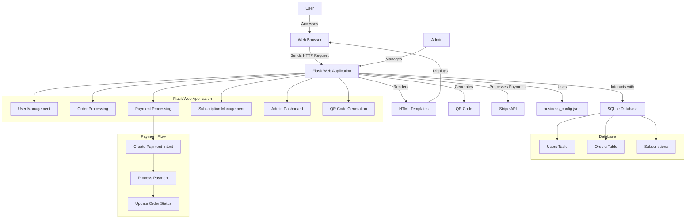

# Technology Stack

## Backend
- Python with Flask framework
- Stripe integration for payments (Payment Intents only)

## Database
- SQLite with SQLAlchemy ORM
- Automatic schema updates and backups

## Frontend
- HTML templates with Bootstrap for styling
- Stripe Elements for payment forms

## Containerization
- Docker for easy deployment

## Additional Services
- ngrok for public access during development

## Key Features

### User Flow
1. User registers/logs in
2. Browses services (one-time or subscription)
3. Selects service and payment method
4. Completes payment (cash or card)
5. Receives order confirmation

### Subscription Flow
1. User selects subscription plan
2. Completes initial payment
3. System tracks service usage
4. Automatic renewal process
5. Cancellation handling

### Admin Flow
1. Manages orders and subscriptions
2. Updates business configuration
3. Monitors payments
4. Generates QR codes
5. Manages database

### Payment Processing
1. Simple Stripe integration using Payment Intents
2. No Stripe Products/Price IDs
3. Pricing managed in business_config.json
4. Support for both one-time and subscription payments

