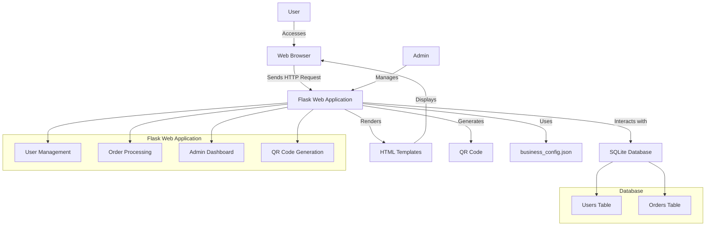

# Technology Stack

## Backend
- Python with Flask framework

## Database
- SQLite with SQLAlchemy ORM

## Frontend
- HTML templates with Bootstrap for styling

## Containerization
- Docker for easy deployment

## Additional Services
- ngrok for public access during development

